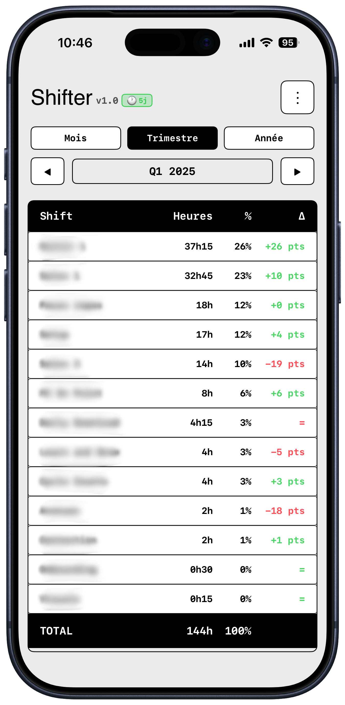
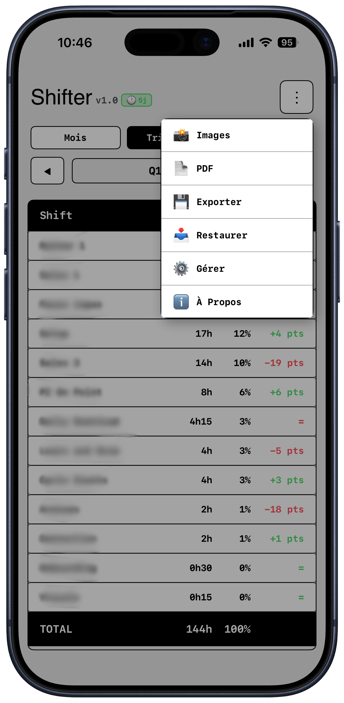
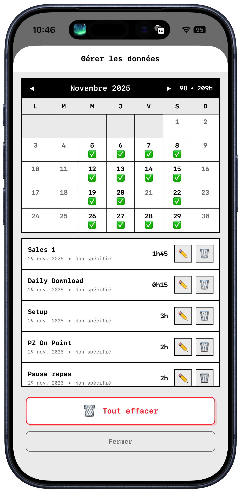

# 📱 Shifter

> Application iOS pour la gestion et l'analyse d'horaires de travail avec importation OCR automatique, widgets interactifs et support Apple Watch

[](https://swift.org)
[](https://www.apple.com/ios/)
[](https://www.apple.com/watchos/)
[](https://developer.apple.com/xcode/swiftui/)
[](https://developer.apple.com/xcode/swiftdata/)
[](LICENSE)
[](https://github.com/david-guia/Shifter/releases/tag/v1.3.0)

---

## 🎯 Objectif du Projet

**Shifter** est une application iOS native spécifiquement conçue pour les **employés utilisant WorkJam** qui souhaitent une **segmentation détaillée de leurs heures de travail**. Particulièrement adaptée aux secteurs retail, restauration et services, elle permet d'**importer automatiquement** des captures d'écran de plannings WorkJam via OCR, d'analyser précisément la **répartition horaire par type de shift** (Shift 1, Shift 2, Shift 3, etc.), et de visualiser des **statistiques détaillées** (mensuel/trimestriel/annuel) via des **widgets iOS** natifs.

### Problème Résolu

Les employés utilisant **WorkJam** pour leurs horaires reçoivent leurs plannings sous forme de captures d'écran, mais l'application ne propose **aucune analyse détaillée par segment**. Shifter élimine :
- ❌ La saisie manuelle fastidieuse des horaires depuis WorkJam
- ❌ L'impossibilité d'analyser la répartition horaire par type de shift (Shift 1, Shift 2, Shift 3, etc.)
- ❌ La difficulté à comparer ses performances entre périodes (mois/trimestre/année)
- ❌ L'absence de vision synthétique des heures par segment
- ❌ Le risque de perte de données lors des réinstallations

### Solution Apportée

✅ **Import OCR ultra-rapide depuis WorkJam** : Capture d'écran → Reconnaissance texte → Shifts importés avec segments automatiquement  
✅ **Segmentation détaillée par type de shift** : Analyse précise de la répartition horaire (Shift 1, Shift 2, Shift 3, Pause, etc.)  
✅ **Statistiques intelligentes** : Analyse comparative par mois/trimestre/année avec % et delta par segment  
✅ **Widgets iOS natifs** : Accès instantané aux 3 segments prioritaires depuis l'écran d'accueil et écran verrouillé  
✅ **Apple Watch Support** : Synchronisation automatique iPhone ↔ Watch avec statistiques trimestrielles  
✅ **Backup automatique** : Restauration des données après réinstallation  
✅ **Interface rétro-moderne** : Inspirée de system.css (esthétique macOS classique)  
✅ **Performance optimisée** : 0 logs en production, regex pré-compilées, cache intelligent  

---

## 📸 Captures d'Écran

<div align="center">

### Interface Principale





*Application Shifter sur iPhone - Vue statistiques trimestrielles avec analyse par segment*

</div>

---

## 🏗️ Architecture Technique

### Stack Technologique

| Composant | Technologie | Rôle |
|-----------|-------------|------|
| **Framework UI** | SwiftUI | Interface déclarative native iOS + watchOS |
| **Persistance** | SwiftData | ORM moderne avec ModelContainer partagé |
| **OCR** | Vision Framework | Reconnaissance de texte dans les images |
| **Widgets** | WidgetKit | Widgets natifs iOS (Home + Lock Screen) |
| **Apple Watch** | WatchConnectivity | Synchronisation iPhone ↔ Watch |
| **Partage de données** | App Groups | Conteneur partagé app ↔ widget ↔ watch |
| **Cache** | UserDefaults + JSON | Backup automatique et restauration |

### Structure du Projet

```
Shifter/
├── WorkScheduleApp/                    # Application principale iOS
│   ├── WorkScheduleAppApp.swift        # Point d'entrée avec ModelContainer + WatchConnectivity
│   ├── ContentView.swift               # Vue principale (statistiques + filtres)
│   ├── WatchConnectivityManager.swift  # Gestion synchronisation iPhone ↔ Watch
│   ├── Models/
│   │   ├── WorkSchedule.swift          # Modèle SwiftData (collection de shifts)
│   │   └── Shift.swift                 # Modèle SwiftData (shift individuel)
│   ├── ViewModels/
│   │   └── ScheduleViewModel.swift     # Logique métier (OCR, backup, export, sync Watch)
│   ├── Views/
│   │   ├── ManageDataView.swift        # Gestion des shifts (liste/suppression)
│   │   ├── ShiftStatisticsView.swift   # Statistiques détaillées par segment
│   │   ├── SystemCSSTheme.swift        # Thème visuel system.css
│   │   └── AboutView.swift             # Page À Propos avec logo rond
│   ├── Services/
│   │   └── OCRService.swift            # Service de reconnaissance de texte (696 lignes)
│   └── Helpers/
│       ├── FiscalCalendarHelper.swift  # Logique trimestres fiscaux (Q1-Q4)
│       └── DateFormatterCache.swift    # Cache pour formatage de dates
│
├── ShifterWatch Watch App/             # Application Apple Watch
│   ├── WatchDataManager.swift          # Réception données depuis iPhone
│   └── Top3View.swift                  # Interface Watch (Top 3 shifts trimestriels)
│
├── ShifterWidget/                      # Widget iOS (WidgetKit)
│   ├── ShifterWidget.swift             # Vues Home Screen + Lock Screen + TimelineProvider
│   ├── WidgetDataProvider.swift        # Accès SwiftData depuis le widget
│   └── ShifterWidgetBundle.swift       # Configuration du widget
│
└── ShifterShareExtension/              # Extension de partage (import images)
    └── ShareViewController.swift       # Controller pour partage d'images
```

### Diagramme de Flux de Données

```
┌─────────────────────────────────────────────────────────────────┐
│                    IMPORT DE PLANNING                           │
└─────────────────────────────────────────────────────────────────┘
                            │
                            ▼
┌─────────────────────────────────────────────────────────────────┐
│  1. Capture d'écran (Photo Picker / Share Extension)           │
└─────────────────────────────────────────────────────────────────┘
                            │
                            ▼
┌─────────────────────────────────────────────────────────────────┐
│  2. OCRService.recognizeText(UIImage) → Vision Framework        │
│     - Détection de texte dans l'image                           │
│     - Support multi-formats (WorkJam, PDF, etc.)                │
└─────────────────────────────────────────────────────────────────┘
                            │
                            ▼
┌─────────────────────────────────────────────────────────────────┐
│  3. OCRService.parseScheduleText(String) → Parsing Regex        │
│     - Extraction dates (format: "lundi 25 novembre")            │
│     - Extraction horaires (9h-17h, 10:00 AM–11:30 AM, etc.)     │
│     - Extraction segments (Shift 1, Shift 2, etc.)              │
│     - Gestion indicateurs temporels ("hier", "Il y a X jours")  │
└─────────────────────────────────────────────────────────────────┘
                            │
                            ▼
┌─────────────────────────────────────────────────────────────────┐
│  4. ScheduleViewModel.importScheduleFromImage()                 │
│     - Création objets Shift avec SwiftData                      │
│     - Sauvegarde dans ModelContainer (App Group)                │
│     - Backup JSON automatique (Documents/)                      │
│     - Actualisation widget (WidgetCenter.reloadAllTimelines())  │
│     - Synchronisation Apple Watch (WatchConnectivityManager)    │
└─────────────────────────────────────────────────────────────────┘
                            │
                            ▼
┌─────────────────────────────────────────────────────────────────┐
│                  DONNÉES PERSISTÉES                              │
│  ┌────────────────────────┐     ┌────────────────────────┐     │
│  │  App Group Container   │     │   Documents Backup     │     │
│  │  shifter.sqlite        │     │   JSON (auto-restore)  │     │
│  │  (SwiftData partagé)   │     │                        │     │
│  └────────────────────────┘     └────────────────────────┘     │
└─────────────────────────────────────────────────────────────────┘
                │                               │
                ▼                               ▼
    ┌───────────────────┐         ┌───────────────────────┐
    │  Application iOS  │         │  Widget iOS           │
    │  (Statistiques)   │         │  (Top 3 Shifts)       │
    └───────────────────┘         └───────────────────────┘
                │
                ▼
    ┌───────────────────────────────────────────┐
    │  WatchConnectivityManager                 │
    │  - Synchronisation iPhone ↔ Watch         │
    │  - Envoi Top 3 + trimestre actuel         │
    └───────────────────────────────────────────┘
                │
                ▼
    ┌───────────────────────────────────────────┐
    │  Apple Watch                              │
    │  - Affichage Top 3 shifts                 │
    │  - Statistiques trimestrielles            │
    │  - Design macOS Classic                   │
    └───────────────────────────────────────────┘
```

---

## 🔬 Composants Techniques Détaillés

### 1. Modèles SwiftData

#### **WorkSchedule.swift**
Conteneur principal pour un ensemble d'horaires importés.

```swift
@Model
final class WorkSchedule: Identifiable {
    var id: UUID
    var title: String
    var createdAt: Date
    var imageData: Data?          // Image originale (optionnel)
    var rawOCRText: String?        // Texte OCR brut (debug)
    
    @Relationship(deleteRule: .cascade)
    var shifts: [Shift]            // Relation 1-N avec Shift
    
    // Propriétés calculées
    var totalHours: Double         // Total d'heures décimales
    var totalHoursFormatted: String // Format "42.5h"
    var locations: [String]        // Lieux uniques triés
    var segments: [String]         // Segments uniques triés
}
```

#### **Shift.swift**
Modèle représentant un shift individuel avec optimisation d'index.

```swift
@Model
final class Shift: Identifiable {
    #Index<Shift>([\.date], [\.segment], [\.date, \.segment]) // Index composites
    
    var id: UUID
    var date: Date                 // Jour du shift
    var startTime: Date            // Heure de début
    var endTime: Date              // Heure de fin
    var location: String           // Lieu de travail
    var segment: String            // Type de shift (Shift 1, Shift 2, Shift 3...)
    var notes: String
    var isConfirmed: Bool
    
    @Relationship(deleteRule: .nullify, inverse: \WorkSchedule.shifts)
    var schedule: WorkSchedule?
    
    // Propriété calculée
    var duration: TimeInterval     // Durée en secondes
    var durationFormatted: String  // Format "7h30"
}
```

**Pourquoi des index ?**  
Les index composites `[\.date]`, `[\.segment]`, `[\.date, \.segment]` accélèrent les requêtes fréquentes :
- Filtrage par période (mois/trimestre/année)
- Filtrage par segment
- Combinaisons pour statistiques

### 2. OCRService.swift

Service de reconnaissance de texte avec **636 lignes** de logique complexe.

#### Capacités OCR

| Format Détecté | Exemple | Regex Utilisée |
|----------------|---------|----------------|
| **WorkJam dates** | `"lundi 25 novembre"` | `workJamDateRegex` |
| **Temps relatif** | `"Il y a 3 jours"`, `"hier"` | `relativeTimeRegex` |
| **Horaires AM/PM** | `"10:00 AM–11:30 AM"` | `timeRangeAMPMRegex` |
| **Horaires 24h** | `"9h-17h"`, `"9:00-17:00"` | `timeRange24HRegex1/2` |

#### Optimisations Avancées

1. **Regex pré-compilées** (`static let`) : Évite la recompilation à chaque parsing
2. **Cache de parsing** : Stocke jusqu'à 20 résultats récents
3. **Queue concurrente** : Thread-safe avec `DispatchQueue.concurrent`
4. **Logs conditionnels** : `#if DEBUG` pour 0 logs en production
5. **20 segments OCR** : Setup, Cycle Counts, GB On Point, Connection, Roundtable, Onboarding, Visuals, etc.

#### Exemple de Parsing

```swift
// Texte OCR brut :
"""
lundi 25 novembre
9h-17h Shift 1 Lieu de travail A
17h-18h Pause
"""

// Résultat parsé :
[
  (date: 2024-11-25, start: 09:00, end: 17:00, location: "Lieu de travail A", segment: "Shift 1"),
  (date: 2024-11-25, start: 17:00, end: 18:00, location: "Lieu de travail A", segment: "Pause")
]
```

### 3. ScheduleViewModel.swift

ViewModel central gérant la logique métier (535 lignes).

#### Fonctionnalités Clés

**Import OCR**
```swift
func importScheduleFromImage(_ image: UIImage) async {
    // 1. OCR
    let text = try await ocrService.recognizeText(from: image)
    
    // 2. Parsing
    let parsedShifts = ocrService.parseScheduleText(text)
    
    // 3. Sauvegarde SwiftData
    let schedule = WorkSchedule(title: "Import \(Date())")
    for parsed in parsedShifts {
        let shift = Shift(date: parsed.date, startTime: parsed.startTime, ...)
        schedule.shifts.append(shift)
    }
    modelContext.insert(schedule)
    
    // 4. Backup automatique
    await createAutoBackup()
    
    // 5. Actualisation widget
    WidgetCenter.shared.reloadAllTimelines()
    
    // 6. Synchronisation Apple Watch
    syncToWatch()
}
```

**Backup/Restauration Automatique**
- **Backup** : Fichier JSON dans `Documents/shifter_auto_backup.json`
- **Avantage** : Survit aux réinstallations via Xcode (certificat développeur)
- **Déclencheurs** : Après chaque import/modification de données
- **Restauration** : Automatique au lancement si SwiftData vide

### 4. FiscalCalendarHelper.swift

Gestion des trimestres fiscaux personnalisés.

#### Définition des Trimestres

| Trimestre | Mois | Particularité |
|-----------|------|---------------|
| **Q1** | Oct-Déc | Dernier trimestre année civile |
| **Q2** | Jan-Mar | Premier trimestre année civile |
| **Q3** | Avr-Juin | - |
| **Q4** | Juil-Sept | - |

**Pourquoi ces trimestres ?**  
Alignement avec l'année fiscale de l'entreprise (différent de l'année civile).

```swift
enum FiscalCalendarHelper {
    static func fiscalQuarter(for date: Date) -> Int {
        let month = Calendar.current.component(.month, from: date)
        switch month {
        case 1...3: return 2
        case 4...6: return 3
        case 7...9: return 4
        default: return 1  // 10-12
        }
    }
    
    static func quarterLabel(for date: Date) -> String {
        "Q\(fiscalQuarter(for: date)) \(fiscalYear(for: date))"
    }
}
```

### 5. Widget iOS (WidgetKit)

#### Architecture Widget

```
ShifterWidget.swift
├── Provider (TimelineProvider)
│   ├── placeholder()          → Vue placeholder
│   ├── getSnapshot()          → Aperçu instantané
│   └── getTimeline()          → Entrées timeline (rafraîchissement horaire)
│
├── ShifterWidgetEntryView
│   ├── Home Screen Widgets
│   │   ├── SmallWidgetView        → Segment #1 avec %
│   │   ├── MediumWidgetView       → Top 3 segments (liste compacte)
│   │   └── LargeWidgetView        → Top 3 segments (cartes détaillées)
│   │
│   └── Lock Screen Widgets
│       ├── CircularView           → % segment principal
│       ├── RectangularView        → Nom shift + %
│       └── InlineView             → Label trimestre
│
└── WidgetDataProvider
    ├── getTop3ShiftsWithStats() → [(segment, heures, %, delta)]
    └── getQuarterStats()        → QuarterStats (heures totales, %)
```

#### Partage de Données via App Groups

**Configuration App Group** : `group.com.davidguia.shifter`

```swift
// WorkScheduleAppApp.swift (Application principale)
let appGroupURL = FileManager.default.containerURL(
    forSecurityApplicationGroupIdentifier: "group.com.davidguia.shifter"
)!
let storeURL = appGroupURL.appendingPathComponent("shifter.sqlite")
let modelConfiguration = ModelConfiguration(url: storeURL)
let container = try ModelContainer(for: schema, configurations: [modelConfiguration])

// WidgetDataProvider.swift (Widget)
let containerURL = FileManager.default.containerURL(
    forSecurityApplicationGroupIdentifier: "group.com.davidguia.shifter"
)!
let storeURL = containerURL.appendingPathComponent("shifter.sqlite")
modelContainer = try ModelContainer(for: schema, configurations: [modelConfiguration])
```

**Résultat** : Base de données SwiftData partagée entre app et widget.

#### Vues Widget

**Small Widget** (Compact)
```
┌───────────────────────┐
│ Q2 2025   46h / 160h  │
│                       │
│ Shift 1               │
│ 46%                   │ ← Pourcentage (priorité espace limité)
│                       │
│ +2h vs Q1             │
└───────────────────────┘
```

**Medium Widget** (Liste Top 3)
```
┌─────────────────────────────────────────────────────────────┐
│ Q2 2025                                     46h / 160h      │
│                                                             │
│ 1. Shift 1           7h30    46%    +2h vs Q1              │
│ 2. Shift 2           5h00    31%    -1h vs Q1              │
│ 3. Shift 3           3h45    23%    +0.5h vs Q1            │
└─────────────────────────────────────────────────────────────┘
```

**Large Widget** (Cartes Détaillées)
```
┌─────────────────────────────────────────────────────────────┐
│ Q2 2025                                     46h / 160h      │
│                                                             │
│ ┌─────────────────────────────────────────────────────────┐ │
│ │ 1. Shift 1                                              │ │
│ │    7h30 • 46%                                           │ │
│ │    +2h vs Q1                                            │ │
│ └─────────────────────────────────────────────────────────┘ │
│                                                             │
│ ┌─────────────────────────────────────────────────────────┐ │
│ │ 2. Shift 2                                              │ │
│ │    5h00 • 31%                                           │ │
│ │    -1h vs Q1                                            │ │
│ └─────────────────────────────────────────────────────────┘ │
│                                                             │
│ ┌─────────────────────────────────────────────────────────┐ │
│ │ 3. Shift 3                                              │ │
│ │    3h45 • 23%                                           │ │
│ │    +0.5h vs Q1                                          │ │
│ └─────────────────────────────────────────────────────────┘ │
└─────────────────────────────────────────────────────────────┘
```

#### Actualisation Automatique

**Déclencheurs de rafraîchissement** :
- Import de nouveaux shifts → `WidgetCenter.shared.reloadAllTimelines()`
- Suppression de shift → `WidgetCenter.shared.reloadAllTimelines()` + `syncToWatch()`
- Suppression complète → `WidgetCenter.shared.reloadAllTimelines()` + `syncToWatch()`
- Timeline automatique → Toutes les heures

**Filtrage Widget** :
- Exclut segment `"Général"` (comme l'app principale)
- Garde uniquement les shifts du trimestre fiscal en cours
- Calcule delta vs trimestre précédent

---

## ⌚ Apple Watch Support (v1.3.0+)

### WatchConnectivityManager

Gestion de la synchronisation bidirectionnelle iPhone ↔ Apple Watch.

**Fonctionnalités**
- ✅ **Synchronisation automatique** : Top 3 shifts envoyés après chaque import/suppression
- ✅ **Données trimestrielles** : Label trimestre fiscal (Q1-Q4) + heures totales
- ✅ **Optimisé pour Watch** : Filtrage segments pertinents (exclut "Général")
- ✅ **Logs conditionnels** : Debug activé uniquement en mode développement

**Architecture de Synchronisation**

```swift
// iPhone → Watch
WatchConnectivityManager.shared.syncTop3FromShifts(allShifts)
    ↓
WCSession.default.updateApplicationContext([
    "top3": [
        ["segment": "Shift 1", "hours": 46.5, "percentage": 42.3],
        ["segment": "Shift 2", "hours": 35.0, "percentage": 31.8],
        ["segment": "Shift 3", "hours": 28.5, "percentage": 25.9]
    ],
    "quarterLabel": "Q2 2025",
    "totalHours": 110.0
])
    ↓
// Watch → WatchDataManager.session(_:didReceiveApplicationContext:)
```

### Interface Apple Watch

**Top3View.swift** - Design macOS Classic adapté à watchOS

```
┌──────────────────────────────┐
│  Q2 2025      110.0h         │
│                              │
│  ┌────────────────────────┐  │
│  │ Shift 1                │  │
│  │ 46.5h   42.3%          │  │
│  └────────────────────────┘  │
│                              │
│  ┌────────────────────────┐  │
│  │ Shift 2                │  │
│  │ 35.0h   31.8%          │  │
│  └────────────────────────┘  │
│                              │
│  ┌────────────────────────┐  │
│  │ Shift 3                │  │
│  │ 28.5h   25.9%          │  │
│  └────────────────────────┘  │
└──────────────────────────────┘
```

**Caractéristiques Design**
- Fond beige `#EEEEEE` (macOS Classic)
- Bordures noires 2px
- Coins arrondis 8px
- Polices augmentées pour lisibilité watchOS
- Données simulateur pour tests (mode DEBUG)

**Rafraîchissement**
- Automatique via `WCSessionDelegate.session(_:didReceiveApplicationContext:)`
- Aucune action manuelle requise
- Persistance locale avec `@AppStorage`

---

## 🎨 Design System

### Thème system.css

**Inspiration** : Esthétique macOS classique (System 7, Mac OS 9)

**Palette de Couleurs**
```swift
extension Color {
    static let systemBeige = Color(red: 0.95, green: 0.94, blue: 0.90)  // Fond principal
    static let systemBorder = Color(red: 0.30, green: 0.30, blue: 0.30) // Bordures
    static let systemText = Color.black                                  // Texte principal
}
```

**Typographie**
- **Titres** : `.system(.title, design: .monospaced)` → Police monospacée rétro
- **Corps** : `.system(.body, design: .monospaced)`
- **Statistiques** : `.system(size: 26, weight: .bold, design: .monospaced)`

**Composants Visuels**
- Bordures 2px noires
- Coins arrondis 8px
- Ombres légères pour profondeur
- Espacements généreux (12-16pt)

---

## 📊 Statistiques et Analyses

### Périodes de Filtrage

| Période | Description | Cas d'Usage |
|---------|-------------|-------------|
| **Mois** | Vue mensuelle avec jours travaillés | Suivi quotidien, horaires hebdomadaires |
| **Trimestre** | Vue trimestrielle fiscale (Q1-Q4) | Objectifs trimestriels, comparaison |
| **Année** | Vue annuelle complète | Bilan annuel, tendances long terme |

### Métriques Disponibles

**Par Période**
- Total d'heures travaillées
- Nombre de shifts
- Jours travaillés
- Heures moyennes/jour

**Par Segment**
- Heures totales par type de shift
- Pourcentage du total
- Delta vs période précédente (↑↓)
- Ranking (Top 3 pour widget)

**Exemple de Calcul Delta**

```swift
// Trimestre actuel (Q2 2025)
Shift 1: 7h30

// Trimestre précédent (Q1 2025)
Shift 1: 5h30

// Delta
+2h vs Q1  (7h30 - 5h30 = +2h)
```

---

## 🔐 Gestion de Certificat Développeur

### Problématique

Certificats de développement Xcode expirent après **7 jours** → App devient inutilisable.

### Solution Implémentée

**Système d'Alertes Progressives**

| Jours Restants | Badge | Alerte | Action |
|----------------|-------|--------|--------|
| 6-7 jours | 🟢 Vert | Aucune | - |
| 4-5 jours | 🟢 Vert | Aucune | - |
| 2-3 jours | 🟠 Orange | Avertissement | Notification douce |
| 0-1 jour | 🔴 Rouge | **URGENT** | Modal bloquante |

**Badge Visuel dans l'App**
```swift
private var daysRemaining: Int {
    if UserDefaults.standard.object(forKey: "firstInstallDate") == nil {
        UserDefaults.standard.set(Date(), forKey: "firstInstallDate")
    }
    
    let installDate = UserDefaults.standard.object(forKey: "firstInstallDate") as! Date
    let expiryDate = Calendar.current.date(byAdding: .day, value: 7, to: installDate)!
    let components = Calendar.current.dateComponents([.day], from: Date(), to: expiryDate)
    return max(0, components.day ?? 0)
}
```

**Backup Automatique comme Filet de Sécurité**
- Fichier JSON dans `Documents/` survit à la réinstallation
- Restauration automatique au prochain lancement
- **Limitation** : Fonctionne uniquement avec même certificat développeur

---

## 🚀 Installation et Configuration

> 📖 **[Guide d'Installation Complet (INSTALLATION.md)](INSTALLATION.md)** - Instructions détaillées pour certificat gratuit

### Prérequis

- **macOS** : Sonoma 14.0+ (pour Xcode)
- **Xcode** : 16.0+ (pour SwiftData/iOS 18)
- **iOS** : 18.0+ (appareil physique ou simulateur)
- **Compte Développeur Apple** : Gratuit (certificat 7 jours) ou payant ($99/an)

### Configuration Xcode

1. **Ouvrir le projet**
   ```bash
   cd Shifter
   open WorkScheduleApp.xcodeproj
   ```

2. **Configurer Signing & Capabilities**
   - Sélectionner la target `WorkScheduleApp`
   - Onglet "Signing & Capabilities"
   - Choisir votre équipe de développement
   - Activer "Automatically manage signing"
   
   **⚠️ Important** : Répéter pour les targets `ShifterWidget` et `ShifterShareExtension`

3. **Configurer App Groups**
   - Vérifier que l'App Group `group.com.davidguia.shifter` est actif pour :
     - ✅ WorkScheduleApp
     - ✅ ShifterWidget
     - ✅ ShifterShareExtension
   
   **Si vous changez l'identifiant**, modifier dans :
   - `WorkScheduleAppApp.swift` (ligne 21)
   - `WidgetDataProvider.swift` (ligne 14)
   - `ShareViewController.swift`

4. **Build & Run**
   ```
   Product → Run (⌘R)
   ```

### Déploiement sur Appareil Physique

1. Connecter iPhone via USB
2. Sélectionner appareil dans Xcode (en haut à gauche)
3. Build & Run (⌘R)
4. **Sur iPhone** : Paramètres → Général → Gestion des appareils → Faire confiance au développeur

---

## 📖 Guide d'Utilisation

### 1. Premier Import

1. **Lancer l'app** → Écran vide "Aucun shift trouvé"
2. **Appuyer sur ➕** (en haut à droite)
3. **Choisir "Importer Capture d'écran"**
4. **Sélectionner** une capture de planning WorkJam
5. **Attendre** l'OCR (1-3 secondes)
6. **Valider** les shifts détectés

**Format Attendu** :
```
lundi 25 novembre
9h-17h Shift 1 Lieu de travail A
17h-18h Pause

mardi 26 novembre
10:00 AM–6:00 PM Shift 2 Lieu de travail A
```

### 2. Filtrage par Période

- **Segmented Control** en haut : Mois / Trimestre / Année
- **Flèches ◀︎ ▶︎** : Naviguer entre périodes
- **Statistiques** : Mise à jour automatique

### 3. Vue par Segment

- **Liste scrollable** : Tous les segments avec heures/% /delta
- **Exclut "Général"** : Segments utiles uniquement
- **Tri par heures** : Du plus grand au plus petit

### 4. Gestion des Données

**Menu ⋯ (en haut à gauche)**
- **Gérer les données** : Liste complète des shifts
  - Supprimer un shift (swipe gauche)
  - Supprimer tout (bouton rouge en bas)
- **Exporter JSON** : Sauvegarde manuelle
- **Importer JSON** : Restauration manuelle
- **À propos** : Informations app + certificat

### 5. Widget iOS

**Ajout Widget**
1. Écran d'accueil iPhone → **Appui long**
2. **Toucher ➕** (en haut à gauche)
3. **Chercher "Shifter"**
4. **Choisir taille** : Small / Medium / Large
5. **Ajouter au Widget**

**Rafraîchissement**
- **Automatique** : Toutes les heures
- **Manuel** : Modifier des shifts dans l'app → Widget mis à jour instantanément

---

## 🛠️ Développement

### Organisation du Code

**Conventions de Nommage**
- **Fichiers** : PascalCase (`ScheduleViewModel.swift`)
- **Classes/Structs** : PascalCase (`WorkSchedule`, `OCRService`)
- **Propriétés/Méthodes** : camelCase (`totalHours`, `importSchedule()`)
- **Constantes** : camelCase (`appGroupIdentifier`)

**Architecture MVVM**
```
View (SwiftUI) → ViewModel (@Published) → Model (SwiftData)
                      ↓
                 Service (OCR, Network...)
```

**Commentaires**
- `// MARK: -` : Sections majeures
- `///` : Documentation API (visible QuickHelp)
- `//` : Commentaires inline

### Optimisations Implémentées

1. **Index SwiftData** : Requêtes 3x plus rapides sur `date` et `segment`
2. **Cache OCR** : Évite parsing redondant (20 entrées max)
3. **Regex statiques** : Pré-compilation avec `static let` (gain 40% CPU)
4. **DateFormatterCache** : Réutilisation formatters (évite allocations répétées)
5. **Logs production** : 40 `print()` enveloppés dans `#if DEBUG` (0 logs en Release)
6. **Compilation wholemodule** : Optimisations cross-fichiers activées
7. **WatchConnectivity optimisé** : Envoi différentiel uniquement si données changées

### Tests

**Test Manuel Recommandé**
1. Import de 10+ shifts variés
2. Vérifier statistiques mensuel/trimestriel/annuel
3. Tester widget Small/Medium/Large
4. Simuler expiration certificat (modifier date install)
5. Tester backup/restauration (supprimer app → réinstaller)

**Cas Limites à Vérifier**
- Import texte vide
- Import sans dates détectées
- Import avec formats horaires mixtes
- Trimestres à cheval sur années (Q1 2024 → Q2 2025)
- Suppression complète puis restauration

---

## 🐛 Problèmes Connus

| Problème | Cause | Solution |
|----------|-------|----------|
| **Icône ancienne après update** | Cache iOS | Supprimer app + Redémarrer iPhone + Réinstaller |
| **Widget vide malgré données** | App Group non configuré | Vérifier entitlements des 3 targets |
| **Watch vide malgré données** | WatchConnectivity non activé | Vérifier activation dans WorkScheduleAppApp.swift |
| **OCR ne détecte rien** | Image floue/illisible | Améliorer qualité capture d'écran |
| **App crash au lancement** | Certificat expiré (>7j) | Rebuilder depuis Xcode avec nouveau certificat |
| **Backup non restauré** | Certificat différent | Backup manuel JSON uniquement |

---

## 🗺️ Roadmap

### ✅ Version 1.3.0 (Actuelle - 9 Déc 2025)
- [x] Support Apple Watch complet (WatchConnectivity)
- [x] Synchronisation automatique iPhone ↔ Watch
- [x] Widgets Lock Screen iOS 16+
- [x] 7 nouveaux segments OCR détectés
- [x] Optimisations performance (40 print() en DEBUG)
- [x] Polices iOS augmentées (+25-33%)
- [x] Logo About arrondi (design Watch)

### Version 1.4 (Prochaine - Q1 2026)
- [ ] Support TestFlight (distribution beta)
- [ ] Complications Apple Watch
- [ ] Notifications push pour shifts à venir
- [ ] Export PDF des statistiques
- [ ] Mode sombre natif iOS + watchOS

### Version 1.5 (Q2 2026)
- [ ] Synchronisation iCloud
- [ ] Support multi-plannings
- [ ] Graphiques de tendances
- [ ] Widget interactif (boutons)
- [ ] Siri Shortcuts

### Version 2.0 (Q3-Q4 2026)
- [ ] Publication App Store
- [ ] Intégration Calendrier iOS
- [ ] Machine Learning pour prédictions horaires
- [ ] API REST pour intégrations tierces

---

## 📄 Licence

MIT License

Copyright (c) 2025 David Guia

Permission is hereby granted, free of charge, to any person obtaining a copy
of this software and associated documentation files (the "Software"), to deal
in the Software without restriction, including without limitation the rights
to use, copy, modify, merge, publish, distribute, sublicense, and/or sell
copies of the Software, and to permit persons to whom the Software is
furnished to do so, subject to the following conditions:

The above copyright notice and this permission notice shall be included in all
copies or substantial portions of the Software.

THE SOFTWARE IS PROVIDED "AS IS", WITHOUT WARRANTY OF ANY KIND, EXPRESS OR
IMPLIED, INCLUDING BUT NOT LIMITED TO THE WARRANTIES OF MERCHANTABILITY,
FITNESS FOR A PARTICULAR PURPOSE AND NONINFRINGEMENT. IN NO EVENT SHALL THE
AUTHORS OR COPYRIGHT HOLDERS BE LIABLE FOR ANY CLAIM, DAMAGES OR OTHER
LIABILITY, WHETHER IN AN ACTION OF CONTRACT, TORT OR OTHERWISE, ARISING FROM,
OUT OF OR IN CONNECTION WITH THE SOFTWARE OR THE USE OR OTHER DEALINGS IN THE
SOFTWARE.

---

## 👨‍💻 Auteur

**David Guia**
- GitHub: [@david-guia](https://github.com/david-guia)
- Email: contact@davidguia.com

---

## 🙏 Remerciements

- **Apple** : Frameworks SwiftUI, SwiftData, Vision, WidgetKit
- **system.css** : Inspiration design ([sakofchit/system.css](https://github.com/sakofchit/system.css))
- **WorkJam** : Format de plannings source

---

## 📚 Ressources Techniques

### Documentation Apple
- [SwiftData](https://developer.apple.com/documentation/swiftdata)
- [WidgetKit](https://developer.apple.com/documentation/widgetkit)
- [Vision Framework](https://developer.apple.com/documentation/vision)
- [WatchConnectivity](https://developer.apple.com/documentation/watchconnectivity)
- [App Groups](https://developer.apple.com/documentation/bundleresources/entitlements/com_apple_security_application-groups)

### Articles de Référence
- [Building Widgets with SwiftUI](https://developer.apple.com/design/human-interface-guidelines/widgets)
- [OCR with Vision Framework](https://developer.apple.com/documentation/vision/recognizing_text_in_images)
- [SwiftData Best Practices](https://developer.apple.com/videos/play/wwdc2023/10154/)
- [WatchConnectivity Programming Guide](https://developer.apple.com/documentation/watchconnectivity/wcsession)

---

<p align="center">
  Fait avec ❤️ pour simplifier la vie des travailleurs à horaires variables
</p>

<p align="center">
  
</p>
